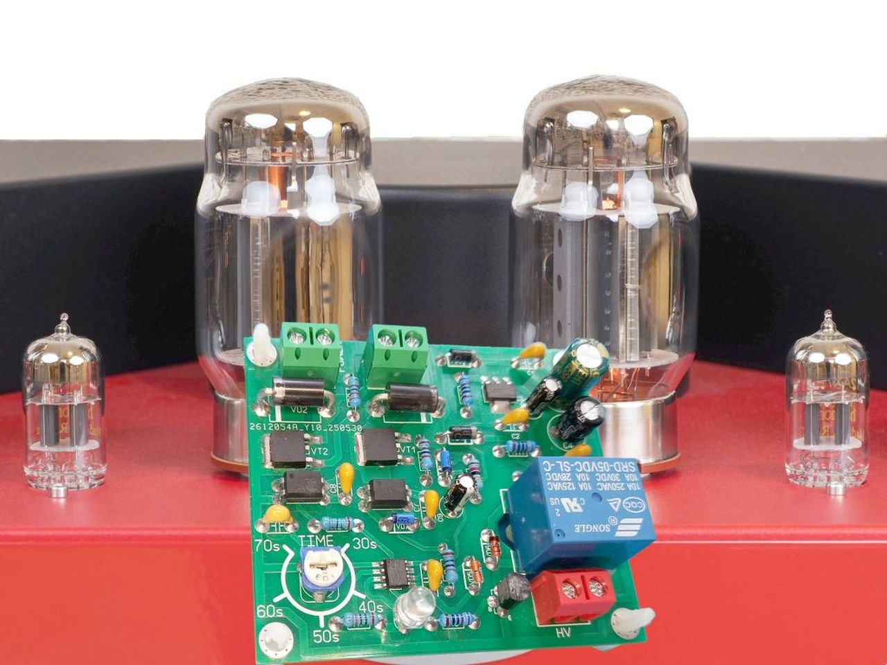

# TubeGuard
protection of tubes in the amplifier
# TubeGuard — Smart Startup Protection for Tube Amplifiers

**TubeGuard** is a smart soft-start and high-voltage delay module for Hi-End vacuum tube amplifiers. Designed for audiophiles, DIY builders, and small amp manufacturers, it protects expensive output tubes from premature wear due to cold starts.

---

## 🎯 What Does It Do?

✔️ Delays high-voltage (B+) activation until cathode heaters reach nominal temperature  
✔️ Soft ramp-up of heater voltage to reduce thermal shock  
✔️ Extends tube life by reducing cathode stripping  
✔️ Compact design — integrates easily into existing amplifiers  
✔️ Compatible with EL34, KT88, 6L6, and most common tubes

---

## 🛠️ How It Works

When the amplifier is powered on:

1. Tube heaters receive gradually increasing voltage (ramp-up phase)
2. After a defined warm-up delay (e.g., 70 seconds), B+ (anode voltage) is enabled
3. An opto-isolated relay or SSR safely applies anode voltage
4. The device ensures correct startup sequencing every time

---

## ⚙️ Technical Specs

| Feature             | Description                            |
|---------------------|----------------------------------------|
| Input Voltage       | 4.5V or 12.6V AC (heater supply)       |
| Operating frequency | from 45 to 60 Hz (within limits)       |
| Output current      | not more than 7.0 A                    |
| Delay Time          | Configurable (typically 30–70 sec)     |
| Output Control      | Relay / SSR for anode line             |
| Control Logic       | Microcontroller-based                  |
| Size                | 70mm x 60mm             |
| Mounting            | Standalone PCB or boxed version        |

---

## 🔧 Applications

- DIY or boutique tube amplifier builds  
- Restoration of vintage gear with added tube protection  
- OEM integration in Hi-End commercial amps  
- Guitar amps with expensive output stages  

---

## 📷 Demo & Video

🎥 **Quick Demo Video**: [YouTube – How TubeGuard Works](https://youtu.be/y10T-EoJwew)

📸 Scope shots, ramp-up graphs, and real-time startup sequence in action.

---

## 🧰 Documentation

- 📄 [PDF Datasheet / One-pager](https://drive.google.com/file/d/1AOC07F2Fkn52j2P3fNtg61ebbzX7vSTC/view)
- 💡 [Circuit Diagram-1](./images/02.jpg)
- 💡 [Circuit Diagram-2](./images/03.jpg)
- 📘 [User Guide](https://drive.google.com/file/d/18n6ji6VZZfq92A9qDqPa3kwrDymVfwSV/view)

---

## 💬 Feedback & Support

Have questions or want to integrate TubeGuard into your product?

📬 Contact: [your.email@example.com](mailto:aurora.west@ymail.com)  
🌐 More info: [your-website.com](https://www.olx.ua/d/uk/obyavlenie/tubeguard-neo-soft-start-tube-amplifier-plavnyy-razogrev-IDTC7jD.html?reason=seller_profile)

---

## 🛒 Where to Buy

- 🔗 [Buy on OLX](https://www.olx.ua/d/uk/obyavlenie/tubeguard-neo-soft-start-tube-amplifier-plavnyy-razogrev-IDTC7jD.html) *(if still active)*   
- 🔗 [Get Gerber files and build your own (coming soon!)*

---

## ⚠️ Disclaimer

> This device works with high voltages. Assembly and integration should be performed by qualified individuals only. Always ensure safe practices when working with tube gear.

---

## ❤️ Credits

TubeGuard is developed and maintained by **Soleng LAB** (Ukraine).  
Inspired by the passion of audio purists who care about their tubes as much as their sound.

